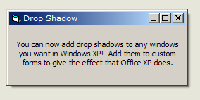

<div align="center">

## Add drop shadows to forms \(XP only\)


</div>

### Description

Adds a drop shadow to any hWnd you specify, just like you see in OfficeXP menus.
 
### More Info
 
hWnd: handle of the window to add drop shadow to.

Only works on Windows XP.


<span>             |<span>
---                |---
**Submitted On**   |
**By**             |[vcv](https://github.com/Planet-Source-Code/PSCIndex/blob/master/ByAuthor/vcv.md)
**Level**          |Beginner
**User Rating**    |5.0 (40 globes from 8 users)
**Compatibility**  |VB 4\.0 \(32\-bit\), VB 5\.0, VB 6\.0
**Category**       |[Graphics](https://github.com/Planet-Source-Code/PSCIndex/blob/master/ByCategory/graphics__1-46.md)
**World**          |[Visual Basic](https://github.com/Planet-Source-Code/PSCIndex/blob/master/ByWorld/visual-basic.md)
**Archive File**   |[](https://github.com/Planet-Source-Code/vcv-add-drop-shadows-to-forms-xp-only__1-30129/archive/master.zip)

### API Declarations

```
Public Declare Function GetClassLong Lib "user32" Alias "GetClassLongA" (ByVal hwnd As Long, ByVal nIndex As Long) As Long
Public Declare Function SetClassLong Lib "user32" Alias "SetClassLongA" (ByVal hwnd As Long, ByVal nIndex As Long, ByVal dwNewLong As Long) As Long
Public Const CS_DROPSHADOW = &H20000
Public Const GCL_STYLE = (-26)
```


### Source Code

```
Sub DropShadow(hwnd As Long)
  SetClassLong hwnd, GCL_STYLE, GetClassLong(hwnd, GCL_STYLE) Or CS_DROPSHADOW
End Sub
```

